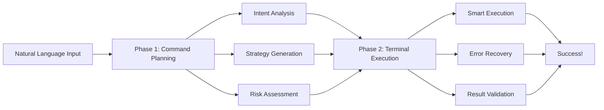

<div align="center">

# 🤖 VEXIS-CLI-1.2


[](https://www.python.org/)
[](LICENSE)
[]()
[](#ai-providers)

**🧠 Transform natural language into powerful terminal automation**

*Your intelligent CLI companion that understands what you want to do and gets it done*

---

[🚀 Quick Start](#installation) • [📖 Documentation](#documentation) • [🎯 Features](#features) • [⚙️ Configuration](#configuration) • [🤝 Contributing](#contributing)

</div>

---

## ✨ Why VEXIS-CLI?

Tired of memorizing complex command-line syntax? **VEXIS-CLI** bridges the gap between human language and terminal commands. Just tell it what you want to accomplish in plain English, and watch as it intelligently executes your requests.

🎯 **"Create a backup of my documents folder"** → Automated backup script  
🎯 **"Find all Python files with syntax errors"** → Code analysis and reporting  
🎯 **"Set up a development environment for React"** → Complete project setup  

---

## 🌟 Key Features

### 🧠 **Intelligent Command Understanding**
- Natural language processing that understands context and intent
- Smart error recovery and self-correction
- Learning from your usage patterns

### ⚡ **Lightning-Fast Execution**
- One-liner command execution
- Parallel processing for complex tasks
- Real-time progress feedback

### 🔗 **Universal AI Provider Support**
- **13+ AI providers** including local and cloud options
- Seamless switching between providers
- Optimized for each provider's strengths

### 🛡️ **Enterprise-Grade Reliability**
- Comprehensive error handling
- Rollback capabilities for failed operations
- Detailed logging and debugging

### 🎨 **Beautiful User Experience**
- Intuitive provider selection interface
- Rich terminal output with syntax highlighting
- Progress indicators and status updates

---

## 🤖 AI Providers

### 🏠 **Local & Hybrid**
<div align="center">

**🦙 Ollama** - Privacy-first local AI with cloud backup  
*Recommended models: `gemma3:4b`, `qwen2.5:3b`, `deepseek-r1:7b`*

</div>

### ☁️ **Cloud Powerhouses**
<div align="center">

| Provider | Specialty | Speed | Best For |
|----------|-----------|-------|----------|
| 🚀 **Groq** | Ultra-fast inference | ⚡⚡⚡⚡⚡ | Real-time tasks |
| 🔮 **Google Gemini** | Enterprise-grade | ⚡⚡⚡⚡ | Business applications |
| 🧠 **OpenAI** | Advanced reasoning | ⚡⚡⚡⚡ | Complex problem-solving |
| 🎭 **Anthropic** | Strong logic | ⚡⚡⚡⚡ | Analytical tasks |
| ⚡ **xAI** | Real-time knowledge | ⚡⚡⚡⚡ | Current events |
| 🦊 **Meta** | Open models | ⚡⚡⚡ | Research |
| 🌊 **Mistral** | Multilingual | ⚡⚡⚡ | Global applications |
| 🔷 **Azure** | Enterprise integration | ⚡⚡⚡ | Corporate environments |
| 🏔️ **AWS Bedrock** | Scalable infrastructure | ⚡⚡⚡ | Large deployments |
| 🎯 **Cohere** | Business workflows | ⚡⚡⚡ | Enterprise automation |
| 🔍 **DeepSeek** | Advanced reasoning | ⚡⚡⚡ | Technical tasks |
| 🤝 **Together AI** | Open-source hosting | ⚡⚡⚡ | Custom models |

</div>

> 💡 **Our Top Picks**: For the best experience, we recommend **Groq** (speed), **Google Gemini** (reliability), **OpenAI** (capability), and **Ollama** (privacy).

---

## 🚀 Installation

### 🎯 **Quick Start (3 commands)**
```bash
git clone https://github.com/vexis-project/VEXIS-CLI-1.2.git
cd VEXIS-CLI-1.2
python3 run.py "list files"  # Auto-installs dependencies!
```

### ✅ **System Requirements**
- **Python 3.9+** 
- **4GB+ RAM** for local models
- **API keys** for cloud providers (get them in minutes)
- **Optional**: Ollama for local AI (`curl -fsSL https://ollama.ai/install.sh | sh`)

### 🎨 **First Run Experience**
When you first run VEXIS-CLI, you'll see our beautiful provider selection interface:


---

## 💻 Usage Examples

### 🏁 **Getting Started**
```bash
# Simple file operations
python3 run.py "create a README for my project"
python3 run.py "find all files larger than 10MB"
python3 run.py "organize my downloads folder by date"

# Development tasks
python3 run.py "set up a Python virtual environment and install requirements"
python3 run.py "run tests and generate coverage report"
python3 run.py "deploy this project to GitHub Pages"

# System administration
python3 run.py "check disk space and clean up temporary files"
python3 run.py "monitor system resources for 5 minutes"
python3 run.py "backup important configuration files"
```

### 🎛️ **Advanced Options**
```bash
# Debug mode for developers
python3 run.py "complex task" --debug

# Skip provider selection (uses your preferred choice)
python3 run.py "quick task" --no-prompt

# Batch processing
python3 run.py "process all images in ./photos --resize 800x600 --quality 85"
```

---

## ⚙️ Configuration

### 📝 **Simple Setup**
Edit `config.yaml` to personalize your experience:

```yaml
api:
  preferred_provider: "groq"  # Your go-to AI provider
  local_endpoint: "http://localhost:11434"
  local_model: "gemma3:4b"     # Stable and fast
  timeout: 120                 # Seconds to wait
  max_retries: 3              # Auto-retry on failures

# Personalization
user:
  name: "Your Name"
  preferred_style: "concise"   # "concise", "detailed", "friendly"
  auto_confirm: false         # Auto-confirm safe operations
```

### 🎯 **Model Recommendations**
- **🏠 Local**: `gemma3:4b` (balanced), `qwen2.5:3b` (fast), `deepseek-r1:7b` (smart)
- **☁️ Cloud**: `gemini-3.1-pro` (reliable), `gpt-5.4` (capable), `claude-opus-4.6` (analytical)

---

## 🏗️ Architecture

### 🧠 **Two-Phase Intelligence Engine**



### � **Core Components**
- **🎯 TwoPhaseEngine** - Orchestrates intelligent command execution
- **🤖 ModelRunner** - Unified interface for all AI providers
- **📝 CommandParser** - Advanced natural language understanding
- **✅ TaskVerifier** - Safety checks and validation systems

---

## 🛠️ Development & Contributing

### 🤝 **How to Contribute**
We love community contributions! Here's how you can help:

1. **🐛 Report Issues**: Found a bug? [Open an issue](https://github.com/vexis-project/VEXIS-CLI-1.2/issues)
2. **💡 Feature Requests**: Have an idea? [Start a discussion](https://github.com/vexis-project/VEXIS-CLI-1.2/discussions)
3. **🔧 Pull Requests**: Ready to code? Check our [contributing guidelines](CONTRIBUTING.md)
4. **📖 Documentation**: Help improve docs - even small fixes help!

### 🧪 **Testing**
```bash
# Run the test suite
python3 -m pytest tests/

# Test specific providers
python3 test_cloud_models.py
python3 check_environment.py
```

---

## 📚 Documentation

| Document | Description | Link |
|----------|-------------|------|
| 📖 **Detailed User Guide** | Comprehensive setup and usage | [DETAILED_GUIDE.md](./DETAILED_GUIDE.md) |
| ⚙️ **Configuration Guide** | Advanced configuration options | [docs/CONFIGURATION.md](./docs/CONFIGURATION.md) |
| 🔧 **Troubleshooting** | Common issues and solutions | [docs/TROUBLESHOOTING.md](./docs/TROUBLESHOOTING.md) |
| 🏗️ **Architecture** | Technical deep-dive | [docs/ARCHITECTURE.md](./docs/ARCHITECTURE.md) |

---

## 🎯 Roadmap

### 🚀 **Coming Soon**
- [ ] **Web Dashboard** - Beautiful GUI for VEXIS-CLI
- [ ] **Plugin System** - Extensible architecture for custom commands
- [ ] **Team Collaboration** - Shared workflows and templates
- [ ] **Voice Control** - Command your terminal with speech
- [ ] **Mobile App** - Control your systems from anywhere

### 🌟 **Future Vision**
- **Autonomous System Management** - Self-healing and optimization
- **Cross-Platform Sync** - Seamless experience across devices
- **AI Model Fine-Tuning** - Personalized to your workflow
- **Enterprise Features** - SSO, audit logs, compliance

---

## 🏆 Community & Support

### 💬 **Get Help**
- 📖 [Documentation](./docs/)
- 🐛 [Issue Tracker](https://github.com/vexis-project/VEXIS-CLI-1.2/issues)
- 💬 [Discussions](https://github.com/vexis-project/VEXIS-CLI-1.2/discussions)
- 📧 [Email Support](mailto:support@vexis-project.com)

### ⭐ **Show Your Love**
- **Star the repo** - It helps others discover VEXIS-CLI
- **Share your use cases** - We love to see what you build!
- **Follow us** - Stay updated with latest features

---

<div align="center">

## 🎉 Ready to Transform Your Terminal Experience?

**Join thousands of developers who've revolutionized their workflow**

[🚀 Get Started Now](#installation) • [⭐ Star on GitHub](https://github.com/vexis-project/VEXIS-CLI-1.2) • [📖 Read the Docs](./docs/)

---

### Made with ❤️ by the VEXIS Project

*Empowering developers with intelligent automation*

---


</div>
