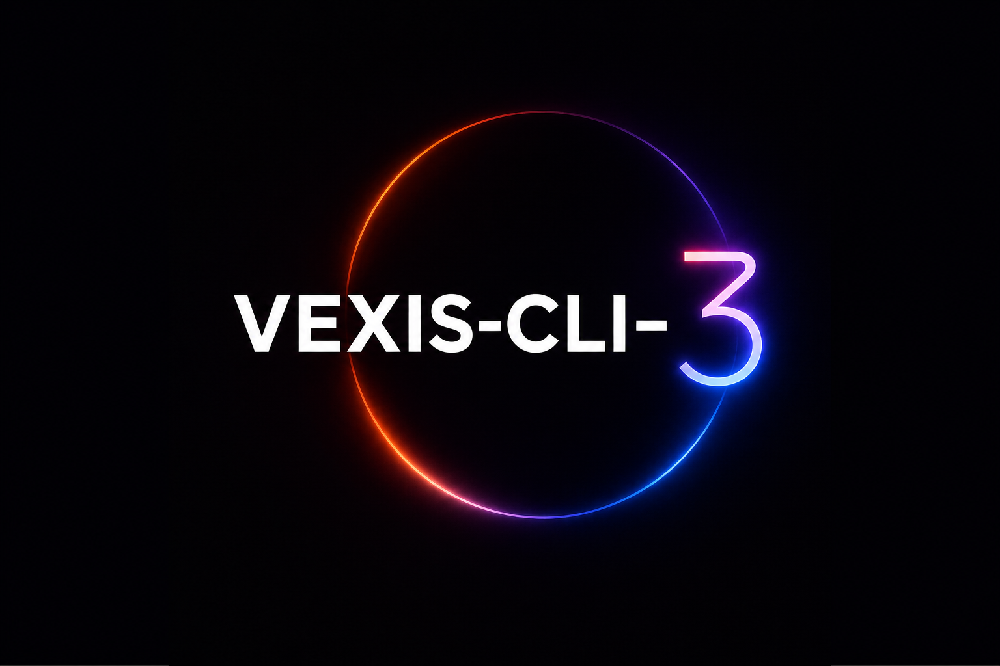
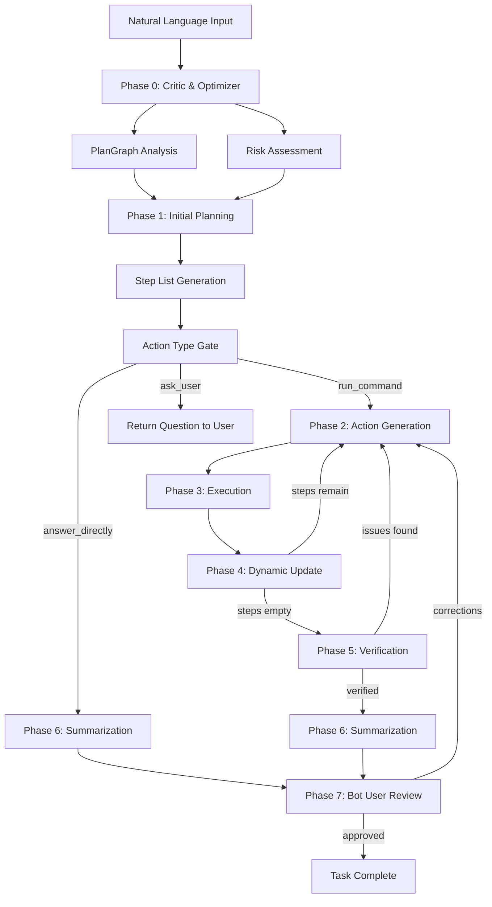

<div align="center">

# VEXIS-CLI-3



[](https://www.python.org/)
[](LICENSE)
[]()
[](#ai-providers)

**🧠 Advanced 8-Phase AI-powered terminal automation system**

*Transform natural language into precise terminal commands with intelligent multi-phase processing*

---

[🚀 Quick Start](#installation) • [📖 Documentation](#documentation) • [🎯 Features](#features) • [⚙️ Configuration](#configuration) • [🤝 Contributing](#contributing)

</div>

---

## ✨ Why VEXIS-CLI-3?

**VEXIS-CLI-3** represents a quantum leap in command-line automation, featuring a sophisticated **8-Phase Pipeline Architecture** that delivers unprecedented accuracy and reliability in natural language to command translation.

🎯 **"Create a backup of my documents folder"** → Intelligent backup with verification
🎯 **"Find all Python files with syntax errors"** → Multi-stage code analysis with reporting
🎯 **"Set up a development environment for React"** → Complete environment setup with validation

---

## 🌟 Revolutionary Features

### 🧠 **8-Phase Pipeline Architecture**
- **Phase 0**: Critic & Optimizer — Analyzes the plan for ambiguity and risk before execution
- **Phase 1**: Initial Planning — AI analyzes intent and generates a step list
- **Phase 2**: Action Generation — Precise command generation in code blocks
- **Phase 3**: Execution — Safe terminal execution with monitoring (100% programmatic)
- **Phase 4**: Dynamic Update — Intelligent error analysis and step list rewriting
- **Phase 5**: Verification — LLM checks if execution was truly successful
- **Phase 6**: Summarization — Comprehensive result reporting
- **Phase 7**: Bot User Review — LLM reviews conversation and evaluates output

### ⚡ **Advanced Execution Engine**
- Multi-iteration error recovery with self-correction
- DAG-based task execution with dependency management
- Real-time progress tracking and status updates
- Intelligent fallback mechanisms across providers
- Comprehensive safety validation and rollback capabilities
- Predictive Subgoal Graph (PSG) replacing linear step lists
- Tool Policy Engine with safety/determinism/cost scoring
- Provenance metadata on all writes and commands
- Context compression at iteration intervals

### 🔗 **Universal AI Provider Ecosystem**
- **17 AI providers** with unified interface abstraction
- Automatic provider selection based on task requirements
- Seamless fallback and load balancing across providers
- Vision API support for image-based tasks

### 🛡️ **Enterprise-Grade Architecture**
- Zero-defect configuration management with validation
- Comprehensive logging with structured output
- Platform abstraction for cross-platform compatibility
- Advanced error handling with detailed diagnostics
- File path validation and sensitive directory protection

### 🎨 **Modern User Experience**
- Rich terminal interface with syntax highlighting
- Interactive provider selection with arrow-key curses menus
- Real-time execution monitoring and feedback
- Telegram bot mode for remote access
- Comprehensive documentation and examples

---

## 🤖 AI Provider Ecosystem

### 🏠 **Local & Privacy-First**
<div align="center">

**🦙 Ollama** — Complete local AI integration
*Recommended models: `llama-4-scout-17b`, `deepseek-r1`, `qwen2.5:7b`*

</div>

### ☁️ **Cloud Providers**
<div align="center">

| Provider | Models | Speed | Specialty |
|----------|--------|-------|-----------|
| 🚀 **Groq** | Llama 3.3 70B, GPT-OSS 120B | ⚡⚡⚡⚡⚡ | Ultra-fast inference |
| 🔮 **Google** | Gemini 3.1 Pro, Gemini 3 Flash | ⚡⚡⚡⚡ | Enterprise reliability |
| 🧠 **OpenAI** | GPT-5.4, GPT-5.4-mini, GPT-4.1 | ⚡⚡⚡⚡ | Advanced reasoning |
| 🎭 **Anthropic** | Claude Opus 4.6, Claude Sonnet 4.6 | ⚡⚡⚡⚡ | Analytical excellence |
| ⚡ **xAI** | Grok 4.1 | ⚡⚡⚡⚡ | Real-time knowledge |
| 🦊 **Meta** | Llama 4 Scout 17B, Maverick 17B | ⚡⚡⚡ | Open-source leadership |
| 🌊 **Mistral** | Mistral Large, Medium, Small | ⚡⚡⚡ | Global applications |
| 🔷 **Microsoft** | GPT-5.4, GPT-4.1 via Azure | ⚡⚡⚡ | Enterprise integration |
| 🏔️ **AWS** | Claude via Bedrock | ⚡⚡⚡ | Scalable infrastructure |
| 🎯 **Cohere** | Command R+, Command R | ⚡⚡⚡ | Enterprise workflows |
| 🔍 **DeepSeek** | DeepSeek Chat, Coder, Reasoner | ⚡⚡⚡ | Technical reasoning |
| 🤝 **Together** | Llama 4 hosting | ⚡⚡⚡ | Custom model deployment |
| 🎮 **MiniMax** | MiniMax-Text-01, ABAB 6.5S | ⚡⚡⚡ | Productivity tasks |
| 🇨🇳 **Zhipu** | GLM-5, GLM-5.1, GLM-4 | ⚡⚡⚡ | Chinese language |
| 🔀 **OpenRouter** | 300+ models via unified API | ⚡⚡⚡ | Model marketplace |

</div>

---

## 🚀 Installation

### 🎯 **Zero-Configuration Quick Start**
```bash
git clone https://github.com/AInohogosya/VEXIS-CLI-3.git
cd VEXIS-CLI-3
python3 run.py "list files"  # Auto-setup and run!
```

### ✅ **System Requirements**
- **Python 3.8+** (wide compatibility)
- **4GB+ RAM** for local models (8GB+ recommended for Llama 4)
- **API keys** for cloud providers
- **Optional**: Ollama for local AI (`curl -fsSL https://ollama.ai/install.sh | sh`)
- **Tested on**: Ubuntu and macOS

> ⚠️ **Note**: Bugs may occur with certain models or providers. If you encounter issues, please try selecting a different model or provider. We will fix the issue as soon as the cause is identified.

### 🎨 **First Run Experience**
VEXIS-CLI-3 features an enhanced provider selection interface with real-time performance metrics:


---

## 💻 Usage Examples

### 🏁 **8-Phase Pipeline in Action**
```bash
# Simple operations with intelligent validation
python3 run.py "create a comprehensive README for my project"
python3 run.py "find and organize files larger than 10MB by date"
python3 run.py "set up Python development environment with testing"

# Complex multi-step tasks
python3 run.py "analyze all Python files for security vulnerabilities"
python3 run.py "deploy this React application to production with monitoring"
python3 run.py "optimize system performance and generate detailed report"

# Advanced automation
python3 run.py "create automated backup system with encryption and verification"
python3 run.py "monitor system resources and alert on anomalies for 24 hours"
```

### 🎛️ **Advanced Configuration**
```bash
# Use specific provider with 8-phase pipeline
python3 run.py "complex task" --provider groq --model llama-3.3-70b-versatile

# Enable debug mode with detailed phase logging
python3 run.py "debug task" --debug

# Skip interactive prompts (uses configured preferences)
python3 run.py "quick automation" --no-prompt

# SDK management
python3 run.py --install-sdks
python3 run.py --sdk-status

# Environment check
python3 run.py --check
python3 run.py --fix
```

---

## ⚙️ Configuration

### 📝 **Advanced Configuration System**
VEXIS-CLI-3 uses a hierarchical configuration system with validation. See [docs/CONFIGURATION.md](./docs/CONFIGURATION.md) for the complete reference.

```yaml
# API Configuration
api:
  preferred_provider: "ollama"
  local_endpoint: "http://localhost:11434"
  local_model: "llama-4-scout-17b"
  timeout: 120
  max_retries: 3

# Engine Configuration
engine:
  max_iterations: 500

# Execution Configuration
execution:
  mode: "normal"  # "normal", "telegram", or "auto"
  command_timeout: 1800
  task_timeout: 7200
  max_iterations: 500

# User Preferences
user:
  name: "Your Name"
  preferred_style: "detailed"  # "concise", "detailed", "friendly"
  auto_confirm: false

# Logging Configuration
logging:
  level: "INFO"
  file: "vexis.log"
  json_format: false
  console: true
```

---

## 🏗️ Advanced Architecture

### 🧠 **8-Phase Pipeline Engine**


```mermaid
graph TB
    A[Natural Language Input] --> B[Phase 0: Critic & Optimizer]
    B --> C[PlanGraph Analysis]
    B --> D[Risk Assessment]
    C --> E[Phase 1: Initial Planning]
    D --> E
    E --> F[Step List Generation]
    F --> G[Action Type Gate]
    G -->|run_command| H[Phase 2: Action Generation]
    G -->|answer_directly| I[Phase 6: Summarization]
    G -->|ask_user| J[Return Question to User]
    H --> K[Phase 3: Execution]
    K --> L[Phase 4: Dynamic Update]
    L -->|steps remain| H
    L -->|steps empty| M[Phase 5: Verification]
    M -->|issues found| H
    M -->|verified| N[Phase 6: Summarization]
    I --> O[Phase 7: Bot User Review]
    N --> O
    O -->|corrections| H
    O -->|approved| P[Task Complete]
```

### 🏛️ **Core Components**
- **🎯 FivePhaseEngine** — Advanced 8-phase pipeline orchestration
- **🤖 ModelRunner** — Unified 17-provider abstraction with fallback
- **📊 PlanGraph** — Predictive Subgoal Graph with dependency tracking
- **🔍 PlanCritic / PlanOptimizer** — Pre-execution plan analysis
- **📝 CommandParser** — Enhanced NLP with context awareness
- **🔧 ToolPolicyEngine** — Safety/determinism/cost scoring
- **📋 ProvenanceTracker** — Metadata on all writes and commands
- **📚 RepositoryIndex** — Multi-layer code index (symbols, test deps)
- **✅ FivePhaseVerifier** — Phase 5 verification via LLM
- **🔄 TaskRobustnessManager** — Advanced error recovery and retry logic
- **📊 TerminalHistory** — Comprehensive execution tracking

---

## 🛠️ Development & Contributing

### 🤝 **Contributing to VEXIS-CLI-3**
We welcome contributions to our advanced AI automation platform:

1. **🐛 Bug Reports**: Use our detailed issue templates for precise reporting
2. **💡 Feature Requests**: Propose enhancements to the 8-phase pipeline
3. **🔧 Pull Requests**: Follow our strict code quality standards
4. **📖 Documentation**: Help maintain our comprehensive docs
5. **🧪 Testing**: Contribute to our extensive test coverage

### 🧪 **Advanced Testing Suite**
```bash
# Run comprehensive test suite
python3 -m pytest tests/ --cov=src

# System validation
python3 check_environment.py
python3 system_check.py
```

### 🔧 **Development Tools**
```bash
# Dependency management
python3 manage_sdks.py --install-all

# Model validation
python3 check_models.py
```

---

## 📚 Comprehensive Documentation

| Document | Focus | Link |
|----------|-------|------|
| 📖 **Architecture Guide** | 8-Phase pipeline deep dive | [docs/ARCHITECTURE.md](./docs/ARCHITECTURE.md) |
| ⚙️ **Configuration Reference** | Complete configuration options | [docs/CONFIGURATION.md](./docs/CONFIGURATION.md) |
| 🔧 **API Reference** | Provider integration guide | [docs/API_REFERENCE.md](./docs/API_REFERENCE.md) |
| 🚀 **Deployment Guide** | Production deployment | [docs/DEPLOYMENT.md](./docs/DEPLOYMENT.md) |
| 🛠️ **Development Guide** | Contributing and development | [docs/DEVELOPMENT.md](./docs/DEVELOPMENT.md) |
| 🔍 **Troubleshooting** | Common issues and solutions | [docs/TROUBLESHOOTING.md](./docs/TROUBLESHOOTING.md) |
| 🦙 **Ollama Integration** | Local AI setup and optimization | [docs/OLLAMA_INTEGRATION.md](./docs/OLLAMA_INTEGRATION.md) |
| ⚡ **Error Handling** | Advanced error management | [docs/ERROR_HANDLING.md](./docs/ERROR_HANDLING.md) |
| 🔗 **Multi-Provider** | Provider integration guide | [docs/MULTI_PROVIDER.md](./docs/MULTI_PROVIDER.md) |
| 🏗️ **Project Structure** | Codebase overview | [docs/PROJECT_STRUCTURE.md](./docs/PROJECT_STRUCTURE.md) |
| 📡 **Runtime Flow** | Execution lifecycle | [docs/RUNTIME_FLOW.md](./docs/RUNTIME_FLOW.md) |

---

## 🏆 Community & Enterprise Support

### 💬 **Get Help**
- 📖 [Comprehensive Documentation](./docs/)
- 🐛 [GitHub Issues](https://github.com/AInohogosya/VEXIS-CLI-3/issues)
- 💬 [Community Discussions](https://github.com/AInohogosya/VEXIS-CLI-3/discussions)

### ⭐ **Show Your Support**
- **⭐ Star the repository** — Help others discover VEXIS-CLI-3
- **🔄 Fork and contribute** — Build on our 8-phase architecture
- **📝 Share your use cases** — Inspire the community with innovative applications

---

<div align="center">

## 🎉 Experience the Future of Terminal Automation

**VEXIS-CLI-3: Where advanced AI meets precise command execution**

[🚀 Get Started Now](#installation) • [⭐ Star on GitHub](https://github.com/AInohogosya/VEXIS-CLI-3) • [📖 Explore Documentation](./docs/)

---

### Built with ❤️ by the VEXIS Project

*Pushing the boundaries of AI-powered automation*

---


</div>
